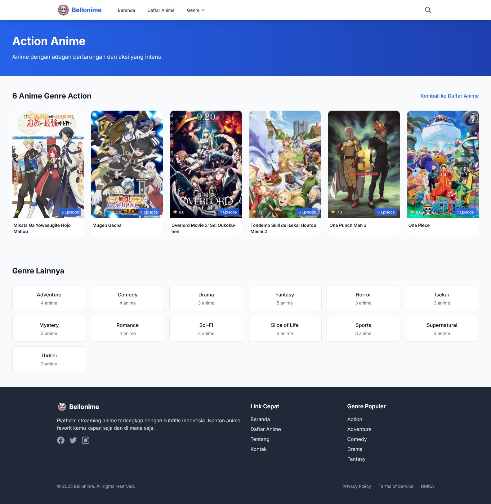
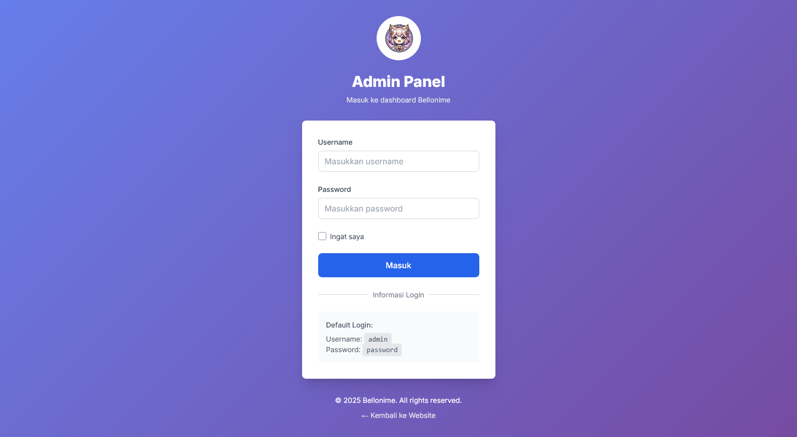
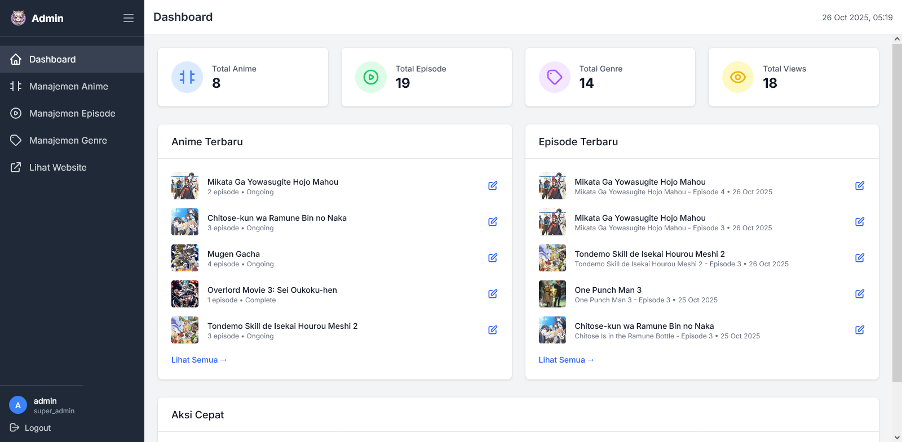
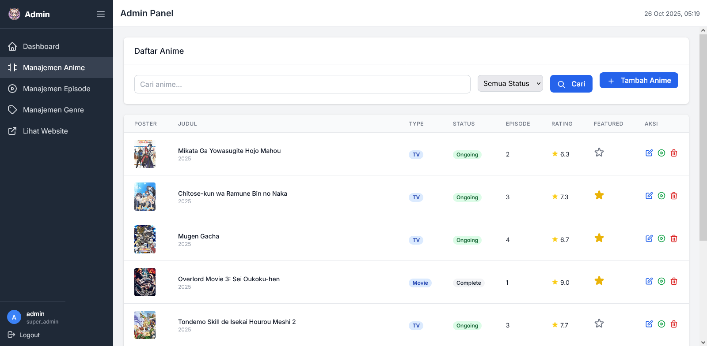
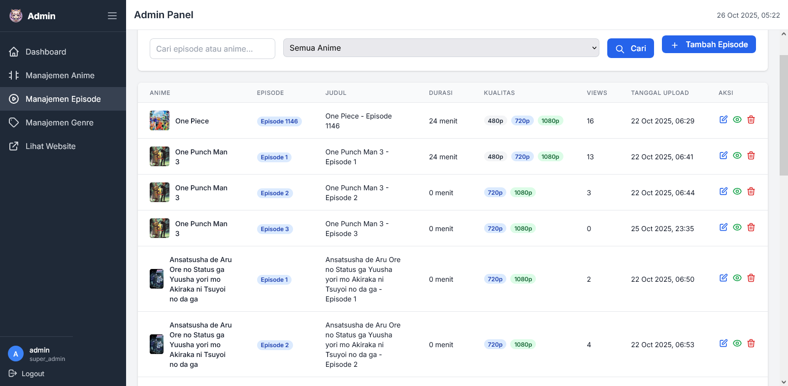
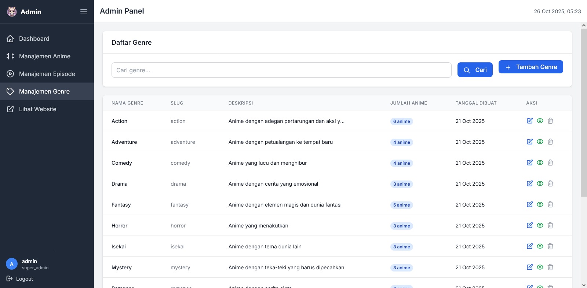

# 👋 Halo, Saya **Ade Tri Fauzan**

📘 **Mahasiswa Universitas Pamulang**  
🧩 **NIM:** 221011401619  
🧠 **Kelas:** 07TPLP020 

# Bellonime - Anime Streaming Website

Website streaming anime yang dibuat dengan PHP Native dan Tailwind CSS. Proyek ini adalah implementasi lengkap dari sistem manajemen konten anime dengan fitur admin panel dan user interface yang modern.

## 🚀 Fitur

### User Interface
- **Homepage** dengan slider anime terpopuler, episode terbaru, dan rekomendasi
- **Daftar Anime** dengan fitur filter, pencarian, dan sorting
- **Detail Anime** dengan informasi lengkap dan daftar episode
- **Video Player** dengan navigasi episode dan kontrol kualitas
- **Pencarian Live** dengan Alpine.js untuk hasil instan
- **Responsive Design** yang optimal di desktop dan mobile

### Admin Panel
- **Dashboard** dengan statistik lengkap
- **CRUD Anime** untuk mengelola data anime
- **CRUD Episode** untuk mengelola episode dan link video
- **CRUD Genre** untuk mengelola kategori
- **Authentication System** dengan session-based login
- **File Upload** untuk poster anime

## 🛠️ Teknologi

- **Backend**: PHP Native dengan PDO untuk database
- **Frontend**: Tailwind CSS dengan Vite untuk compilation
- **Database**: MySQL/MariaDB
- **JavaScript**: Alpine.js untuk interaktivitas
- **Video Player**: Plyr.io
- **Icons**: Heroicons

## 📁 Struktur Folder

```
bellonime/
├── admin/                  # Halaman admin
│   ├── includes/          # Template admin
│   ├── index.php          # Dashboard
│   ├── login.php          # Login admin
│   ├── logout.php         # Logout
│   ├── manage-anime.php   # CRUD anime
│   ├── manage-episode.php # CRUD episode
│   └── manage-genre.php   # CRUD genre
├── assets/                # File statis
│   ├── css/              # CSS hasil compile
│   ├── js/               # JavaScript
│   └── images/           # Upload poster anime
├── core/                  # File core PHP
│   ├── connection.php    # Koneksi database
│   └── functions.php     # Fungsi-fungsi utama
├── templates/             # Template user
│   ├── header.php        # Header
│   └── footer.php        # Footer
├── index.php              # Homepage
├── anime-list.php         # Daftar anime
├── detail.php             # Detail anime
├── nonton.php             # Halaman nonton
├── genre.php              # Halaman per genre
├── search.php             # API pencarian
├── input.css              # Tailwind input
├── package.json           # Dependencies
├── tailwind.config.js     # Konfigurasi Tailwind
└── vite.config.js         # Konfigurasi Vite
```

## 📋 Persyaratan

- PHP 7.4+ atau PHP 8.x
- MySQL/MariaDB
- Node.js (untuk development)
- Composer (opsional)

## 🛠️ Instalasi

### 1. Clone Repository
```bash
git clone <repository-url>
cd bellonime
```

### 2. Setup Database (Cara Otomatis)
Akses `http://localhost/bellonime/setup.php` dan ikuti instruksi:
1. Masukkan detail koneksi database
2. Klik "Install Database"
3. Setup akan otomatis:
   - Membuat database
   - Import semua tabel
   - Membuat user admin (username: admin, password: password)
   - Menambah sample data (5 anime dengan episode)
   - Mengkonfigurasi file koneksi

### 3. Setup Database (Cara Manual)
1. Buat database baru di MySQL/MariaDB
2. Import file `database.sql` ke database
   ```sql
   mysql -u username -p database_name < database.sql
   ```
3. Edit file `core/connection.php` dan sesuaikan koneksi database:
```php
define('DB_HOST', 'localhost');
define('DB_NAME', 'bellonime');
define('DB_USER', 'username');
define('DB_PASS', 'password');
```

### 4. Install Dependencies
```bash
npm install
```

### 5. Compile CSS
Untuk development:
```bash
npm run dev
```

Untuk production:
```bash
npm run build
```

### 6. Image Handling
Semua gambar (poster/background) sekarang menggunakan URL eksternal dan tidak disimpan di folder proyek.
- Tidak ada proses upload file lokal.
- Pastikan URL gambar menggunakan http/https dan dapat diakses publik.
- Jika nilai gambar kosong atau bukan URL valid, sistem menampilkan placeholder eksternal.

### 7. Konfigurasi Web Server

#### Apache
Tambahkan ini di `.htaccess`:
```apache
RewriteEngine On
RewriteCond %{REQUEST_FILENAME} !-f
RewriteCond %{REQUEST_FILENAME} !-d
```

#### Nginx
```nginx
location / {
    try_files $uri $uri/ /index.php?$query_string;
}
```

## 🎯 Penggunaan

### Admin Panel
1. Akses `http://localhost/bellonime/admin/login.php`
2. Login dengan:
   - Username: `admin`
   - Password: `admin123`
3. Mulai tambah anime, episode, dan genre

### Menambah Anime
1. Di admin panel, pilih "Manage Anime"
2. Klik "Add New Anime"
3. Upload poster dan isi informasi anime
4. Tambah episode setelah anime dibuat

### Menambah Episode
1. Di admin panel, pilih "Manage Episode"
2. Pilih anime yang akan ditambah episode
3. Masukkan link video (MP4 atau embed)
4. Simpan episode

## 🔧 Konfigurasi Tambahan

### Base URL
Edit `core/connection.php` untuk mengatur base URL:
```php
define('BASE_URL', 'http://localhost/bellonime/');
```

### Upload Settings
Konfigurasi ukuran maksimal upload di `php.ini`:
```ini
upload_max_filesize = 10M
post_max_size = 10M
```

## 🎨 Kustomisasi

### Warna Tema
Edit `tailwind.config.js` untuk mengubah warna tema:
```javascript
theme: {
    extend: {
        colors: {
            primary: {
                // Warna tema utama
            }
        }
    }
}
```

### Menambah Halaman Baru
1. Buat file PHP baru di root directory
2. Include template header dan footer:
```php
<?php require_once 'templates/header.php'; ?>
<!-- Konten halaman -->
<?php require_once 'templates/footer.php'; ?>
```

## 🔒 Keamanan

- SQL Injection prevention dengan prepared statements
- XSS prevention dengan `htmlspecialchars()`
- Admin panel protection dengan session
- File upload validation
- CSRF protection ready

## 📱 Responsive Design

Website sudah dioptimalkan untuk:
- Desktop (1920px+)
- Tablet (768px - 1024px)
- Mobile (320px - 768px)

## 🚀 Deployment

### Production Checklist
1. Ubah konfigurasi database ke production
2. Jalankan `npm run build` untuk CSS production
3. Upload semua file ke server
4. Set proper file permissions
5. Import database ke production server
6. Update `BASE_URL` di `core/connection.php`

## 🐞 Debugging

### Error Reporting
Aktifkan error reporting di development:
```php
ini_set('display_errors', 1);
error_reporting(E_ALL);
```

### Debug Queries
Tambahkan ini di `core/connection.php` untuk debug SQL:
```php
pdo->setAttribute(PDO::ATTR_ERRMODE, PDO::ERRMODE_EXCEPTION);
```

## 🤝 Kontribusi

1. Fork repository
2. Buat branch baru (`git checkout -b feature/AmazingFeature`)
3. Commit perubahan (`git commit -m 'Add some AmazingFeature'`)
4. Push ke branch (`git push origin feature/AmazingFeature`)
5. Open Pull Request

## 📝 License

Proyek ini hanya untuk tujuan pembelajaran. Penggunaan konten anime tanpa izin adalah ilegal.

## ⚠️ Disclaimer

Website ini dibuat untuk tujuan pembelajaran dan demonstrasi. Penggunaan konten anime tanpa lisensi resmi melanggar hak cipta. Gunakan dengan bijak dan tanggung jawab.

## 🆘 Bantuan

Jika mengalami masalah:
1. Cek file README ini
2. Pastikan semua persyaratan terpenuhi
3. Cek error log PHP dan web server
4. Pastikan konfigurasi database benar

---

**Happy Coding! 🎉**

## Fitur Baru: Kualitas Video & Integrasi HXFile (Oktober 2025)

- Dropdown kualitas per episode (480p, 720p, 1080p) di halaman nonton.
- Integrasi HXFile:
  - Upload langsung dari browser ke HXFile (direct-to-HXFile), tanpa lewat hosting.
  - Auto-fill link Embed dan Download berdasarkan filecode.
  - Progress bar dan persentase upload di form admin.
  - Hindari re-upload saat klik Simpan/Update (file input dibersihkan + hidden flags).
  - Fallback pintar:
    - Jika direct upload gagal, fallback ke endpoint server (opsional).
    - Lookup filecode berdasarkan nama file jika respon upload belum memuat filecode.
  - Nama file dan MIME dipertahankan (tidak .tmp), mis. .mp4.

Bagian kode inti:
- Ticket (server_url, sess_id) untuk direct upload: [admin/hxfile-ticket.php](admin/hxfile-ticket.php:1)
- Direct upload fallback (server-side): [admin/hxfile-upload.php](admin/hxfile-upload.php:1)
- Lookup filecode by filename: [admin/hxfile-lookup.php](admin/hxfile-lookup.php:1)
- Admin form (progress UI + direct upload + auto-fill): [admin/episode-form.php](admin/episode-form.php:262)
- Logika simpan/edit (hindari re-upload, isi otomatis dari filecode): [admin/manage-episode.php](admin/manage-episode.php:76)
- Resolusi API key HXFile: [core/functions.php](core/functions.php:453)

## Konfigurasi HXFile

Set API key HXFile lewat environment variable:
```bash
# Windows Powershell
$env:HXFILE_API_KEY="your_api_key_here"

# Linux/Mac
export HXFILE_API_KEY="your_api_key_here"
```

Atau definisikan constant di PHP (opsi alternatif):
```php
define('HXFILE_API_KEY', 'your_api_key_here');
```

Fungsi resolver memprioritaskan ENV, lalu constant, lalu fallback contoh (ganti dengan milik Anda):
- Resolver: [core/functions.php](core/functions.php:453)

Direkomendasikan menambah batas upload saat pengembangan/hosting (opsional):
- .htaccess (contoh):
```apache
php_value upload_max_filesize 512M
php_value post_max_size 512M
php_value memory_limit 1024M
php_value max_execution_time 600
php_value max_input_time 600
```

## Cara Pakai (Admin) – HXFile Direct Upload

1. Buka Admin → Manage Episode → Tambah/Edit.
2. Pada bagian “HXFile Upload per Kualitas”, pilih file untuk 480/720/1080.
3. Proses akan:
   - Minta ticket ke server: [admin/hxfile-ticket.php](admin/hxfile-ticket.php:1)
   - Upload langsung dari browser ke HXFile (progress tampil).
   - Auto-fill input Embed/Download.
   - Set hidden flags + filecode agar saat Simpan/Update tidak re-upload: [admin/manage-episode.php](admin/manage-episode.php:76)
4. Jika direct upload gagal, fallback ke endpoint server: [admin/hxfile-upload.php](admin/hxfile-upload.php:1)
5. Jika response upload tidak mengembalikan filecode, sistem lookup berdasarkan nama file: [admin/hxfile-lookup.php](admin/hxfile-lookup.php:1)

## Screenshot

> Seluruh screenshot berada di folder `./foto`. Berikut beberapa tampilan utama.

- Beranda  
  

- Daftar Anime  
  

- Detail Anime  
  

- Nonton Anime (dengan opsi kualitas)  
  

- Halaman Genre  
  

- Admin Login  
  

- Admin Dashboard  
  

- Admin: Manage Anime  
  

- Admin: Manage Episode  
  

- Admin: Manage Genre  
  

- Admin: Tambah/Edit Anime  
  

- Admin: Tambah/Edit Genre  
  

- Admin: Tambah/Edit Episode (dengan HXFile upload)  
  


## Additional Media

The HXFile &amp; Quality Features visual summary is now available:

- SVG Collage: foto/hxfile-features.svg

Preview:


